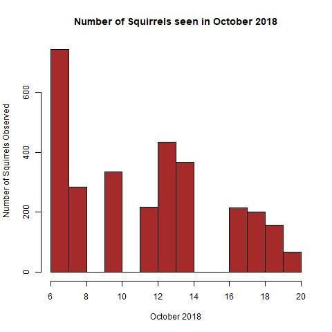
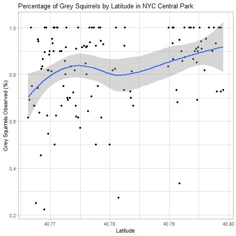
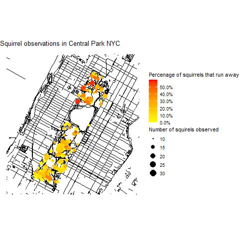
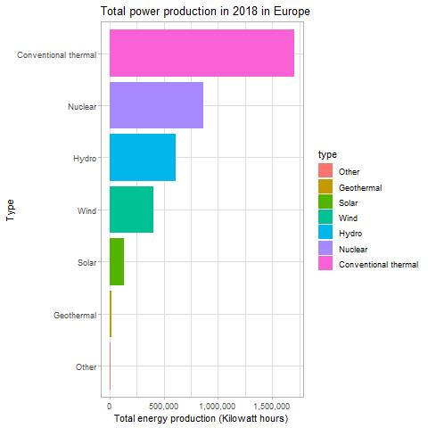
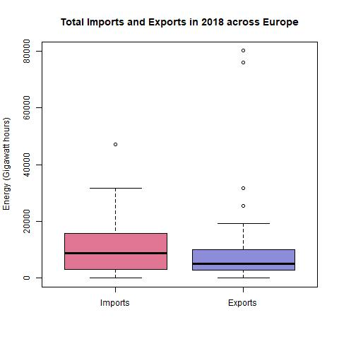
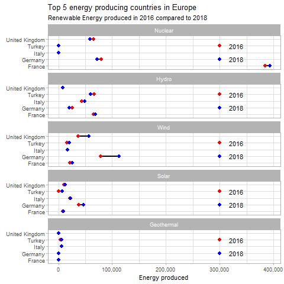

# Data-Visulisations

<!-- TABLE OF CONTENTS -->

  
<h2 style="display: inline-block">Table of Contents</h2>

        <a href="#About the project">About the Project</a>
      <ul>
      <a href="#Invasive Species Africa">Invasive Species Africa</a>
      <ul>
        <li><a href="#gg plot">gg plot</a></li>
        <li><a href="#Base r plot">Base r plot</a></li>
        <li><a href="#gg plot">gg plot</a></li>
         <li><a href="#Interactive graph">Interactive plot</a></li>
      </ul>
  <a href="#NYC Squirrel Census">NYC Squirrel Census</a>
      <ul>
        <li><a href="#Base r plot">Base r plot</a></li>
        <li><a href="#gg plot">gg plot</a></li>
        <li><a href="#gg plot">gg plot</a></li>
         <li><a href="#Interactive graph">Interactive plot</a></li>
  </ul>
   <a href="#European energy">European energy</a>
      <ul>
        <li><a href="#gg plot">gg plot</a></li>
        <li><a href="#Base r plot">Base r plot</a></li>
        <li><a href="#gg plot">gg plot</a></li>
        <li><a href="#Interactive graph">Interactive plot</a></li>
    </ul>
    <li><a href="#References">References</a></li>
  </ol>

<!-- ABOUT THE PROJECT -->
## About The Project
This repository contain 3 markdown files, each looking at a seperate TidyTuesday.

Each file contain 4 data visulisations including those made in base r, ggplot and an interactive plot.

<!-- INVASIVE SPECIES AFRICA -->
## Invasive Species Africa

This dataset looks at the associated costs and threat of invasive species to African countries, giving their mean GDP, environmental systems and the kingdoms of each species. The dataset was created by merging 3 separate datasets; table_1 and table_3 were created as part of the Paini et al. (2016) paper “Global threat to Agriculture from Invasive Species” and Africa_species from griis.org (2019).

### gg plot

### Base r plot

### gg plot

### Interactive graph

<!-- NYC SQUIRREL CENSUS -->

## NYC Squirrel Census

This data was collected by The Central Park Squirrel Census 2019 and was carried out to research squirrel locations, population densities, fur coloration patterns, approximate age, human interaction, activities and communication in Central Park, New York. This green space covers more than 840 acres (Central Park Conservancy, 2021)in central Manhattan, where these omnivorous mammals live alongside 1.632 million people (census.gov, 2021).

### Base r plot

### gg plot

### gg plot

### Interactive graph

<!-- EUROPEAN ENERGY -->

## European Energy

These data visualisations looked at 2 datasets based on European energy, provided by Eurostat (2020). The first dataset, Energy_types looks at energy sources over the period 2016 – 2018, detailing the country, how the energy was produced (e.g. wind, conventional thermal, nuclear, hydro, wind, solar, geothermal or other) and the amount of energy produced. The second dataset Country_totals gives the same information, however, includes whether the energy was imported, exported, total net production, energy absorbed by pumping, and energy supplied. Both datasets include an unclear variable named “Level” that was composed of two factors.

### gg plot

### Base r plot

### gg plot

### Interactive graph

