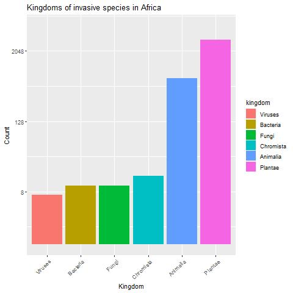
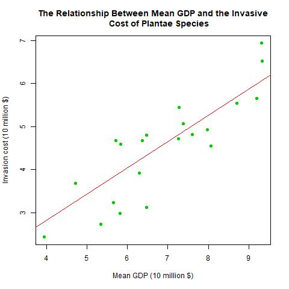
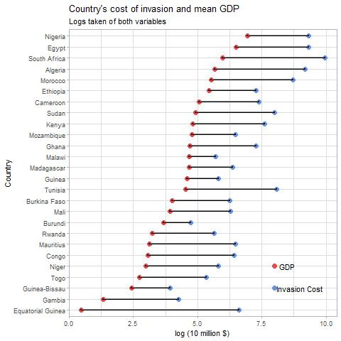

# Data-Visulisations

<!-- TABLE OF CONTENTS -->

  
<h2 style="display: inline-block">Table of Contents</h2>

        <a href="#About the project">About the Project</a>
      <ul>
      <a href="#Invasive Species Africa">Invasive Species Africa</a>
      <ul>
        <li><a href="#gg plot">gg plot</a></li>
        <li><a href="#Base r plot">Base r plot</a></li>
        <li><a href="#gg plot">gg plot</a></li>
         <li><a href="#Interactive graph">Interactive plot</a></li>
      </ul>
  <a href="#NYC Squirrel Census">NYC Squirrel Census</a>
      <ul>
        <li><a href="#Base r plot">Base r plot</a></li>
        <li><a href="#gg plot">gg plot</a></li>
        <li><a href="#gg plot">gg plot</a></li>
         <li><a href="#Interactive graph">Interactive plot</a></li>
  </ul>
   <a href="#European energy">European energy</a>
      <ul>
        <li><a href="#gg plot">gg plot</a></li>
        <li><a href="#Base r plot">Base r plot</a></li>
        <li><a href="#gg plot">gg plot</a></li>
        <li><a href="#Interactive graph">Interactive plot</a></li>
    </ul>
    <li><a href="#References">References</a></li>
  </ol>

<!-- ABOUT THE PROJECT -->
## About The Project
This repository contain 3 markdown files, each looking at a seperate TidyTuesday.

Each file contain 4 data visulisations including those made in base r, ggplot and an interactive plot.

<!-- INVASIVE SPECIES AFRICA -->
## Invasive Species Africa

### gg plot

### Base r plot

### gg plot

### Interactive graph

<!-- NYC Squirrel Census -->

## NYC Squirrel Census

### Base r plot

### gg plot

### gg plot

### Interactive graph
