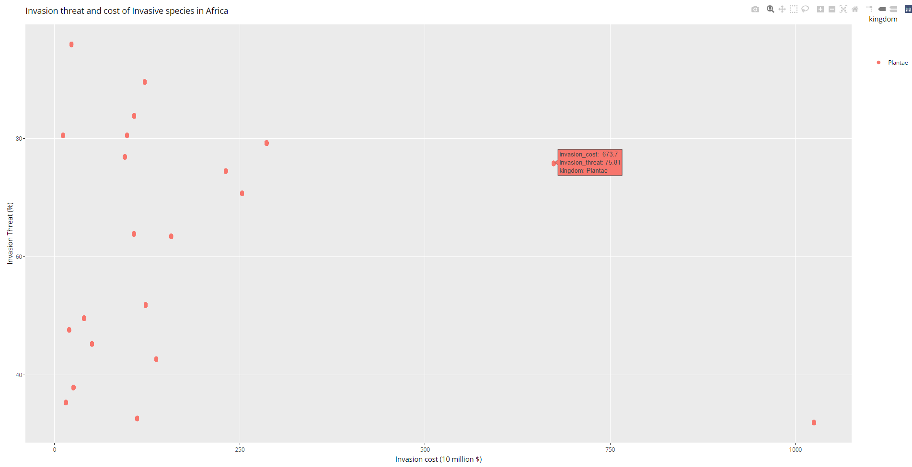
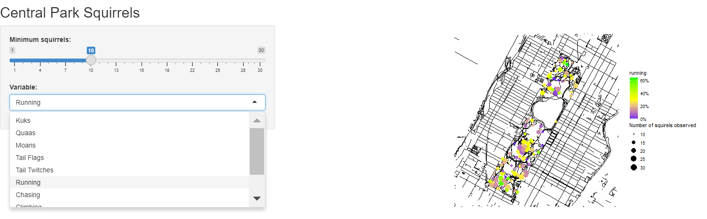
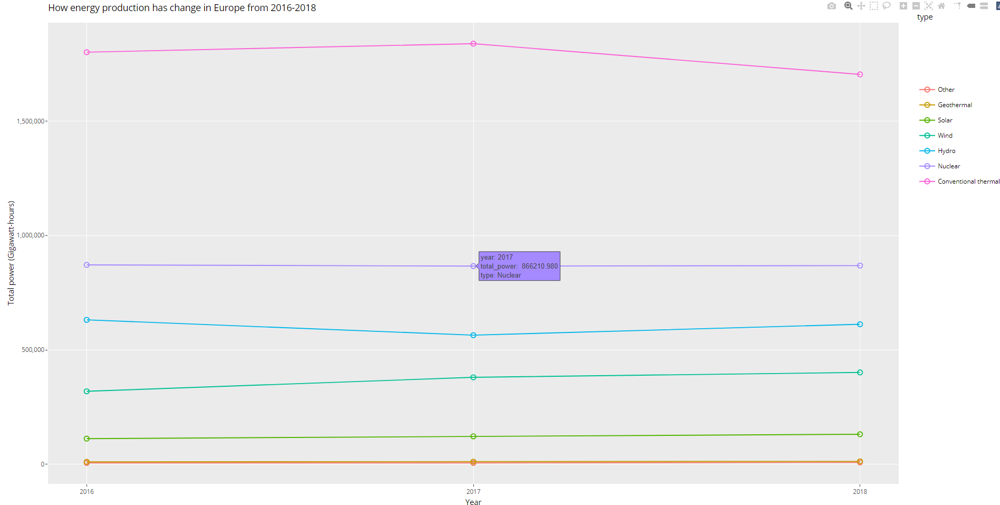

# Data-Visulisations

<!-- TABLE OF CONTENTS -->

  
<h2 style="display: inline-block">Table of Contents</h2>

        <a href="#About the project">About the Project</a>
      <ul>
      <a href="#Invasive Species Africa">Invasive Species Africa</a>
      <ul>
        <li><a href="#gg plot">gg plot</a></li>
        <li><a href="#Base r plot">Base r plot</a></li>
        <li><a href="#gg plot">gg plot</a></li>
         <li><a href="#Interactive graph">Interactive plot</a></li>
      </ul>
  <a href="#NYC Squirrel Census">NYC Squirrel Census</a>
      <ul>
        <li><a href="#Base r plot">Base r plot</a></li>
        <li><a href="#gg plot">gg plot</a></li>
        <li><a href="#gg plot">gg plot</a></li>
         <li><a href="#Interactive graph">Interactive plot</a></li>
  </ul>
   <a href="#European energy">European energy</a>
      <ul>
        <li><a href="#gg plot">gg plot</a></li>
        <li><a href="#Base r plot">Base r plot</a></li>
        <li><a href="#gg plot">gg plot</a></li>
        <li><a href="#Interactive graph">Interactive plot</a></li>
    </ul>
    <li><a href="#References">References</a></li>
  </ol>

<!-- ABOUT THE PROJECT -->
## About The Project
This repository contain 3 markdown files, each looking at a seperate TidyTuesday.

Each file contain 4 data visulisations including those made in base r, ggplot and an interactive plot.

<!-- INVASIVE SPECIES AFRICA -->
## Invasive Species Africa

This dataset looks at the associated costs and threat of invasive species to African countries, giving their mean GDP, environmental systems and the kingdoms of each species. The dataset was created by merging 3 separate datasets; table_1 and table_3 were created as part of the Paini et al. (2016) paper “Global threat to Agriculture from Invasive Species” and Africa_species from griis.org (2019).

### gg plot

In this first visulisation from this dataset, I wanted to see how many invasive species were part of each kingdom, which identified that there are many more invasive species part of the animalia and plantae kingdoms than any other kingdoms.  

### Base r plot

Having identified that the most invasive species as part of the Plantae kingdom, I wanted to see if there was a relationship between the Mean GDP and the Invasion cost. This showed that there was a strong positive correlation between mean GDP and Invasion cost.
### gg plot

I now wanted to see how the correlation of mean GDP and invasion cost differed in African countries. As a general trend, mean GDP increases as the invasion cost increases. There are exceptions to this, for example Equatorial Guinea has the lowest GDP, however has a high invasion cost.

### Interactive graph

I used this visuliation to see how Invasion threat and cost of invasive species correlated. The benefit of this graph being interactive, is that it includes a zoom feature, highlighting that there were many points at each visual point.

<!-- NYC SQUIRREL CENSUS -->

## NYC Squirrel Census

This data was collected by The Central Park Squirrel Census 2019 and was carried out to research squirrel locations, population densities, fur coloration patterns, approximate age, human interaction, activities and communication in Central Park, New York. This green space covers more than 840 acres (Central Park Conservancy, 2021)in central Manhattan, where these omnivorous mammals live alongside 1.632 million people (census.gov, 2021).

### Base r plot

As an initial look at the data, I wanted to see if squirrels were more likely to be sighted at a part of the month in October. The graph shows that the most squirrels were seen at the begnining on the month, and then no real trend throughout the rest on the month.

### gg plot

 

Through some preliminary investigation, Grey squirrels are the most common in this dataset and all observations were within NYC Central Park. This lead me to wonder if there was any significant as to where in the park grey squirrels were sighted. This shows that grey squirrels are more likely to be found in the north of Central park, with a dip in observations in the middle due to a pond.

### gg plot

This graph started to look at how squirrels reacted to humans, showing squirrels are more likely to run away in the north of the park.

### Interactive graph

Using a shinyApp, I was able to plot on the map of Central Park all the activities and behaviorurs of grey squirrels in Central Park.

<!-- EUROPEAN ENERGY -->

## European Energy

These data visualisations looked at 2 datasets based on European energy, provided by Eurostat (2020). The first dataset, Energy_types looks at energy sources over the period 2016 – 2018, detailing the country, how the energy was produced (e.g. wind, conventional thermal, nuclear, hydro, wind, solar, geothermal or other) and the amount of energy produced. The second dataset Country_totals gives the same information, however, includes whether the energy was imported, exported, total net production, energy absorbed by pumping, and energy supplied. Both datasets include an unclear variable named “Level” that was composed of two factors.

### gg plot

Firstly, looking at this dataset I wanted to see how overall power was produced in Europe in 2018. This shows that non-renuable energy (Conventional thermal) was still producing a lot of European energy.

### Base r plot

Considering this total power production in 2018, I wanted to see how much of this energy produced was exported, and conversely how much was imported.

### Interactive graph

Using plotly, I could plot to see how energy production has changed over time. Although conventional thermal is still producing much of Europe's energy, it has significantly reduced in 2018, with small increases in most renewable sources.

### gg plot

Having seen that there were only small changes to renewable energy production, I picked out the top 5 energy producing countries to see how energy production has chagne from 2016 to 2018.

## References

Census.gov. 2021. Rankings by population.[online] *census.gov* Available at: Ranking by Population - Places in Manhattan - Place Rankings - Data Commons (Accessed: 12th Feb. 2021)

Central Park Conservancy. 2021. About us. [online] *Central Park Conservancy.* Available at: About the Central Park Conservancy | Central Park Conservancy (centralparknyc.org) (Accessed: 12th Feb. 2021)

Eurostat. 2020. Shedding light on energy in the EU. [online] *Eurostat Statistics explained.* Available at: https://ec.europa.eu/eurostat/cache/infographs/energy/index.html (Accessed: 15th Feb. 2021)

Griis. 2019. Sources. [online] *Global register of introduced and invasive species*. Available at: http://www.griis.org/sources.php (Accessed: 29th Feb. 2021)

Paini, D.R., Sheppard, A.W., Cook, D.C., De Barra, P.J., Worner, S.P & Thomas, M.B. 2016. Global threat to agriculture from invasive species. *PNAS.* 133(27), pp. 7575-7579.
